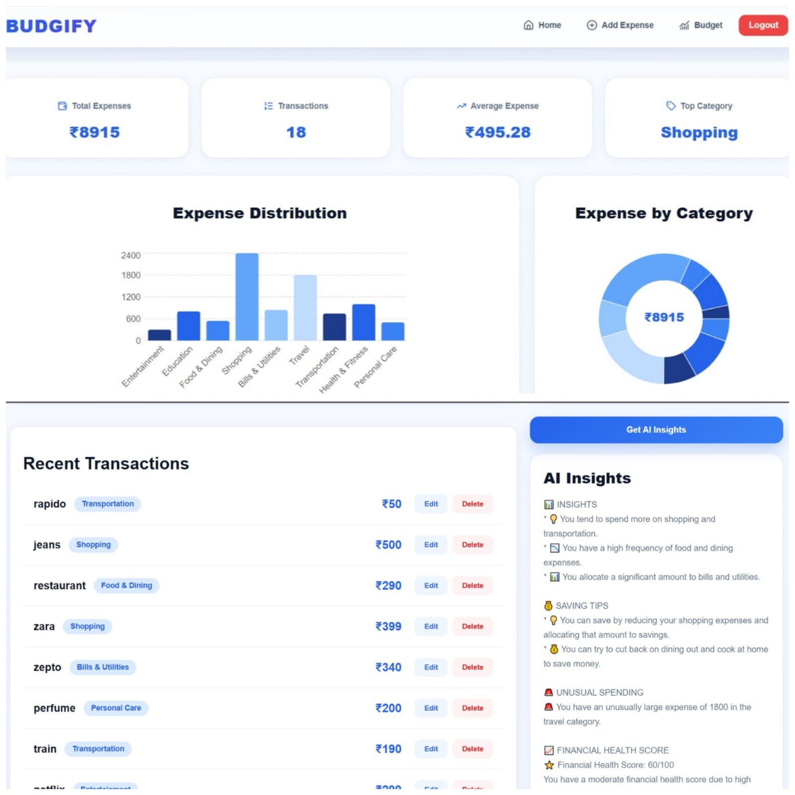
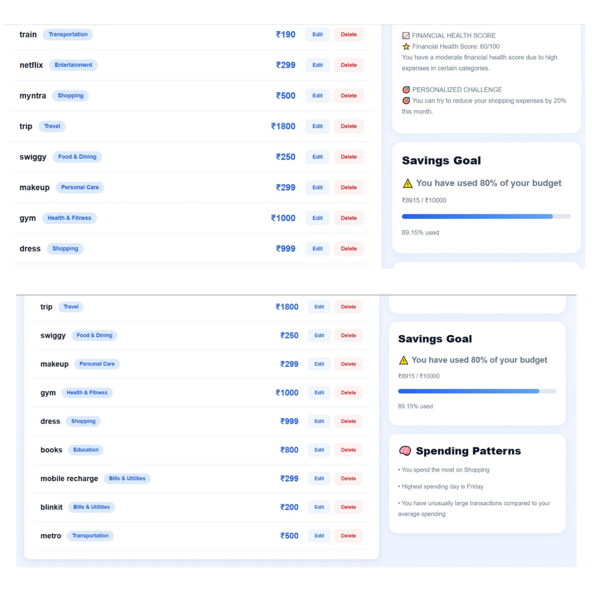
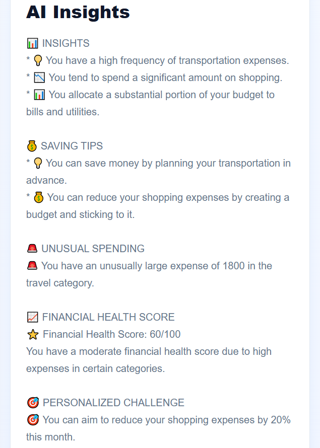
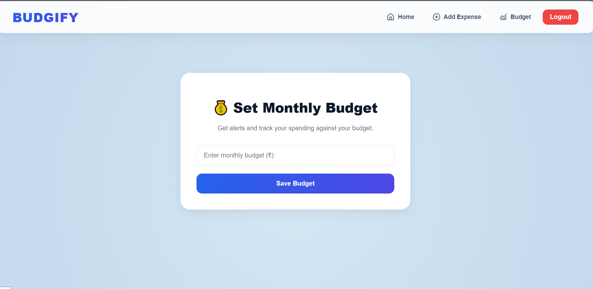
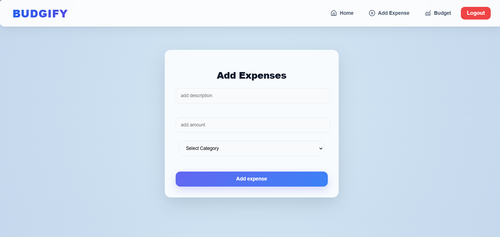
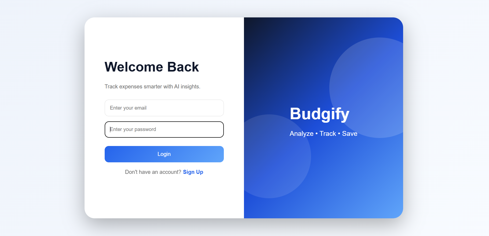

# 💰 Budgify – AI-Powered Expense Tracker with Smart Financial Insights

An AI-powered full-stack expense tracking application that helps users manage their finances, monitor budgets, visualize spending habits, and receive intelligent financial insights.

Built using **React, Node.js, Express.js, PostgreSQL, and the Groq API**.

---

# 🚀 Features

- 🔐 Secure User Authentication (Signup/Login)
- ➕ Add, Update & Delete Expenses
- 🤖 AI-Powered Financial Insights using Groq
- 🏷 Automatic Expense Categorization
- 📊 Interactive Expense Analytics Dashboard
- 🥧 Category-wise Expense Distribution
- 💰 Monthly Budget Management
- 🚨 Budget Alerts
- 🧠 Spending Pattern Detection
- 📱 Responsive User Interface

---

# 📸 Screenshots


### Landing Page


### Dashboard





### AI Insights



### Budget Page



### Add Expense



### Login



---

# 🛠 Tech Stack

## Frontend

- React.js
- CSS3
- React Router DOM
- Recharts
- Lucide React

## Backend

- Node.js
- Express.js

## Database

- PostgreSQL

## AI Integration

- Groq API (LLM)

---

# ✨ Key Features

## Authentication

- User Signup
- User Login
- JWT-based Authentication

---

## Expense Management

- Add Expenses
- Update Expenses
- Delete Expenses
- View Expense History

---

## AI Features

- Personalized Spending Insights
- Actionable Saving Tips
- Unusual Spending Detection
- Financial Health Score
- Personalized Financial Challenge

---

## Analytics Dashboard

- Expense Distribution Bar Chart
- Category-wise Pie Chart
- Summary Cards
- Average Expense Calculation
- Top Spending Category

---

## Budget Management

- Set Monthly Budget
- Real-Time Budget Tracking
- Budget Usage Percentage
- Budget Alert

---

## Spending Pattern Detection

Automatically identifies:

- Highest spending category
- Frequent spending trends
- Budget risk alerts
- Expense behavior patterns

---

# 📂 Project Structure

```
Smart-Expense-Tracker
│
├── frontend
│   ├── public
│   ├── src
│   │   ├── components
│   │   ├── pages
│   │   ├── App.js
│   │   └── index.js
│   └── package.json
│
├── backend
│   ├── controllers
│   ├── middleware
│   ├── models
│   ├── routes
│   ├── utils
│   ├── db.js
│   ├── server.js
│   └── package.json
│
├── screenshots
├── README.md
└── .gitignore
```

---

# ⚙ Installation

## Clone Repository

```bash
git clone https://github.com/kaurashi/budgify.git
```

## Frontend

```bash
cd frontend
npm install
npm start
```

## Backend

```bash
cd backend
npm install
node server.js
```

---

# 🔑 Environment Variables


```
DATABASE_URL=your_postgresql_database_url

JWT_SECRET=your_secret_key

GROQ_API_KEY=your_groq_api_key

PORT=5000
```

---

# 📈 Future Improvements

- Expense Export (PDF / CSV)
- Email Notifications
- Dark Mode
- Monthly Reports
- Mobile Application
- Multi-Currency Support

---

# 👨‍💻 Author

**Ashmeet Kaur**

GitHub: https://github.com/kaurashi

LinkedIn: https://linkedin.com/in/ashmeet-kaur01

---

# ⭐ Support

If you found this project useful, consider giving it a ⭐ on GitHub!
